# Contextos Limitados - Plataforma de Investimentos

Este documento apresenta a arquitetura baseada em **Domain-Driven Design (DDD)** com **Bounded Contexts** da nossa plataforma de investimentos.

## Diagrama dos Contextos Limitados

```mermaid
graph TB
    subgraph "Plataforma de Investimentos - Bounded Contexts"
        
        subgraph "Auth Context"
            AU[User Entity]
            AS[Auth Service]
            AT[JWT Token]
            
            AU --> AS
            AS --> AT
        end
        
        subgraph "Suitability Context"
            IP[InvestorProfile Entity]
            QU[Questionnaire]
            RP[Risk Profile]
            
            IP --> QU
            QU --> RP
        end
        
        subgraph "Product Catalog Context"
            PD[Product Entity]
            PC[Product Categories]
            PR[Price Updates]
            
            PD --> PC
            PD --> PR
        end
        
        subgraph "Portfolio Context"
            PO[Portfolio Entity]
            PS[Position]
            PF[Performance]
            DV[Diversification]
            
            PO --> PS
            PS --> PF
            PO --> DV
        end
        
        subgraph "Transactions Context"
            TR[Transaction Entity]
            TS[Transaction Status]
            TH[Transaction History]
            
            TR --> TS
            TR --> TH
        end
        
        subgraph "Backoffice Context"
            RP[Reports]
            AL[Audit Logs]
            CM[Compliance]
            
            RP --> CM
            AL --> CM
        end
    end
    
    subgraph "Shared Infrastructure"
        LOG[Winston Logger]
        VAL[Joi Validation]
        MW[Express Middleware]
    end
    
    subgraph "External Integration Points"
        DB[(In-Memory Storage)]
        API[External APIs]
        JWT[JWT Authentication]
    end
    
    %% Context Interactions
    AU -.->|"authenticates"| PO
    AU -.->|"has profile"| IP
    IP -.->|"validates investment"| TR
    TR -.->|"updates"| PO
    TR -.->|"uses products"| PD
    PO -.->|"tracks products"| PD
    TR -.->|"generates logs"| AL
    PO -.->|"generates reports"| RP
    
    %% Infrastructure connections
    AU --> LOG
    IP --> LOG
    PD --> LOG
    PO --> LOG
    TR --> LOG
    RP --> LOG
    
    AU --> VAL
    IP --> VAL
    PD --> VAL
    PO --> VAL
    TR --> VAL
    
    %% External connections
    AU --> DB
    IP --> DB
    PD --> DB
    PO --> DB
    TR --> DB
    RP --> DB
    
    AS --> JWT
    PD --> API
    
    classDef authContext fill:#FFE6CC,stroke:#D79B00,stroke-width:2px
    classDef suitabilityContext fill:#D4E6F1,stroke:#2E86AB,stroke-width:2px
    classDef productContext fill:#D5E8D4,stroke:#82B366,stroke-width:2px
    classDef portfolioContext fill:#F8CECC,stroke:#B85450,stroke-width:2px
    classDef transactionContext fill:#E1D5E7,stroke:#9673A6,stroke-width:2px
    classDef backofficeContext fill:#FFF2CC,stroke:#D6B656,stroke-width:2px
    classDef infrastructure fill:#F0F0F0,stroke:#666,stroke-width:1px
    classDef external fill:#EDEDED,stroke:#999,stroke-width:1px
    
    class AU,AS,AT authContext
    class IP,QU,RP suitabilityContext
    class PD,PC,PR productContext
    class PO,PS,PF,DV portfolioContext
    class TR,TS,TH transactionContext
    class RP,AL,CM backofficeContext
    class LOG,VAL,MW infrastructure
    class DB,API,JWT external
```

